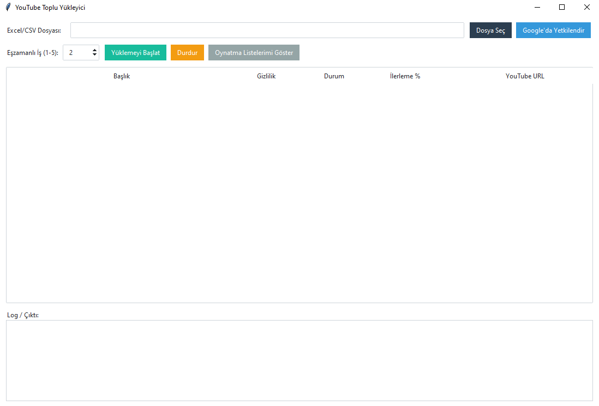

==================================================
<br>
🎬 YouTube Toplu Video Yükleyici - EBS

==================================================


Bu program, Excel veya CSV dosyası üzerinden belirlediğiniz videoları 
YouTube kanalınıza otomatik olarak yüklemenizi sağlar. 
Program bir GUI (grafik arayüz) ile çalışır ve metro tarzı modern bir 
tasarıma sahiptir. Yükleme sırasında anlık ilerleme yüzdesini, logları 
ve yüklenen videoların YouTube linklerini gösterir.
--------------------------------------------------
Program Ekran Görüntüsü

--------------------------------------------------
📌 1) Program Nedir?
--------------------------------------------------
- Bir Excel/CSV dosyasında video listesi oluşturursunuz.
- Her satırda video dosyası yolu, başlık, açıklama, etiketler vb. bilgileri girersiniz.
- Programı çalıştırıp dosyanızı seçersiniz.
- Program, YouTube Data API v3 üzerinden videoları kanalınıza yükler.
- İsteğe bağlı: Thumbnail yükleme, oynatma listesine ekleme, planlı yayınlama.

--------------------------------------------------
📌 2) Özellikler
--------------------------------------------------
- Çoklu video yükleme
- Başlık, açıklama, etiket, gizlilik ayarı desteği
- Shorts videolar (<60 sn) için özel kurallar (otomatik algılar, thumbnail atlaması yapar)
- Thumbnail doğrulama (format, boyut, çözünürlük)
- Playlist’e ekleme
- Yayın zamanı planlama (scheduled)
- Anlık ilerleme yüzdesi ve log takibi
- Metro (modern) tasarımlı arayüz
- Eşzamanlı yükleme (aynı anda 1–5 video)

--------------------------------------------------
📌 3) Kurulum Talimatları
--------------------------------------------------
1. Python 3.9+ kurulu olduğundan emin olun: 
   https://www.python.org/downloads/

2. Gerekli paketleri yükleyin:
   ```
   pip install -r requirements.txt
   ```

3. Dosyalar:
   - youtube_bulk_uploader.py   → Programın ana dosyası
   - requirements.txt           → Gerekli paketler
   - video_upload_template.xlsx → Örnek Excel şablonu
   - client_secret.json         → Google API kimlik dosyanız (aşağıda anlatılıyor)

4. Programı çalıştırın:
   ```
   python youtube_bulk_uploader.py
   ```

5. GUI açıldığında:
   - "Dosya Seç" → Excel/CSV dosyanızı seçin.
   - "Google’da Yetkilendir" → Tarayıcı açılır, hesabınızla giriş yapın ve izin verin.
   - "Yüklemeyi Başlat" → Videolar yüklenmeye başlar.

--------------------------------------------------
📌 4) Excel/CSV Şablonu
--------------------------------------------------
video_path | title | description | tags | privacyStatus | publishAt | playlist_id | thumbnail_path | categoryId | made_for_kids | is_short | duration_seconds

Örnek:
C:\vid\video1.mp4 | Haber 1 | Beykoz'da gelişmeler | beykoz,haber | public |  | PLxxxxxxx | C:\vid\thumb1.jpg | 22 | false |  | 
C:\vid\short.mp4  | Kısa Video | Shorts örneği | deneme,shorts | public |  |  |  | 22 | false | true | 

- privacyStatus: public | unlisted | private | scheduled
- publishAt: yalnızca scheduled için ISO tarih: 2025-10-05T14:00:00+03:00
- playlist_id: Playlist kimliği (aşağıda anlatılıyor)
- thumbnail_path: jpg/png (2MB, 1280x720 önerilir)
- is_short: true/false (opsiyonel)
- duration_seconds: video süresi (opsiyonel, <60 sn ise short sayılır)

--------------------------------------------------
📌 5) API Anahtarı / Yetkilendirme Alma
--------------------------------------------------
Programın çalışabilmesi için Google Cloud Console üzerinden 
YouTube Data API v3 erişimi almanız gerekir.

Adımlar:

1) Google Cloud Console’a giriş yapın:
   https://console.cloud.google.com/

2) Yeni proje oluşturun:
   "Select project" → "New Project"

3) YouTube Data API v3’ü etkinleştirin:
   - Menü: APIs & Services → Library
   - "YouTube Data API v3" arayın ve "Enable" butonuna tıklayın

4) OAuth onay ekranı ayarları:
   - Menü: APIs & Services → OAuth consent screen
   - User Type: External seçin
   - App Name, Support Email, Developer Contact Email girin
   - Test Users kısmına YouTube kanalınızı yönettiğiniz Gmail adresini ekleyin
   - Save & Continue

5) OAuth istemci kimliği oluşturun:
   - Menü: APIs & Services → Credentials
   - "Create Credentials" → "OAuth client ID"
   - Application type: Desktop App seçin
   - Oluşturun ve JSON dosyasını indirin

6) İndirdiğiniz JSON dosyasını proje klasörüne koyun ve ismini:
   ```
   client_secret.json
   ```
   yapın.

7) Programı çalıştırdığınızda "Google’da Yetkilendir" butonuna tıklayın:
   - Tarayıcı açılacak, giriş yapın
   - İzinleri onaylayın
   - İlk defa girişte `token.json` oluşacak (tekrar giriş gerekmez)

--------------------------------------------------
📌 6) Playlist ID Nasıl Bulunur?
--------------------------------------------------
1. Programda "Oynatma Listelerimi Göster" butonuna tıklayın.
2. Log penceresinde tüm oynatma listeleriniz başlık + ID ile listelenir.
3. Excel’de `playlist_id` alanına bu ID’yi girin.
   (Örn: PLNRTuLsUCgR2qveAboXXXI1zLc-YXYSQi)

--------------------------------------------------
📌 7) Kota (Quota) Bilgisi
--------------------------------------------------
- YouTube Data API v3 kotası günlük 10.000 birimdir.
- Her video yükleme (videos.insert) 1600 birim harcar.
- Bu da günde max 6–7 video yüklemesine denk gelir.
- Daha fazla yüklemek için:
  - Google Cloud Console’dan quota increase talep edin
  - Veya yeni proje açıp farklı client_secret.json kullanın

--------------------------------------------------
📌 8) Sorun Giderme
--------------------------------------------------
- 403 access_denied → Hesabınızı Test Users listesine ekleyin
- Playlist not found → Playlist ID yanlış, URL değil ID girilmeli
- Thumbnail hatası → Format jpg/png olmalı, 2MB altında ve 1280x720 üzeri
- API kotası doldu → Ertesi gün sıfırlanır veya yeni proje açın
